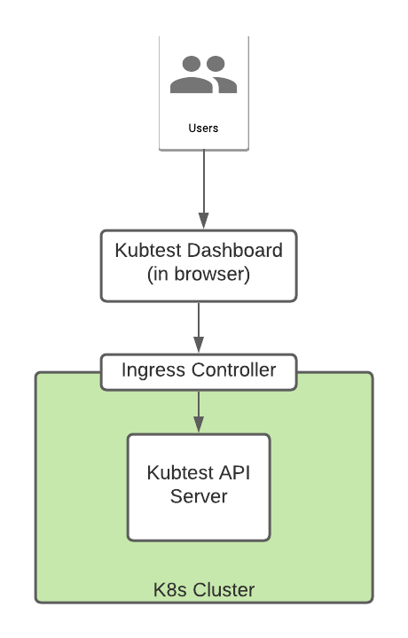
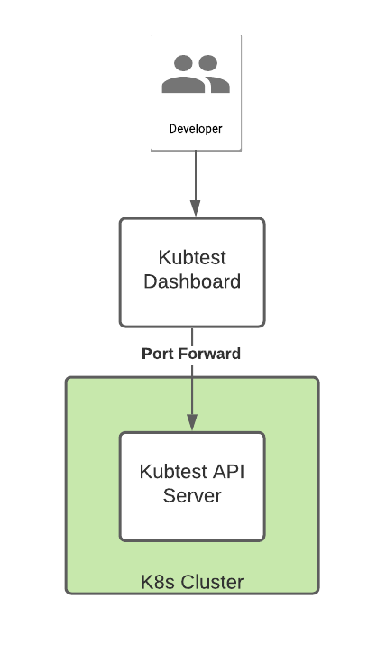

# Kubtest Dashboard 

A simple read-only dashboard for real-time Kubtest results.

The Kubtest Dashboard is deployed as a standalone web application in a cluster running Kubtest. It runs in the browser
and communicates with the Kubtest api-server via an Ingress controller (either provided or bundled):



Available operations for the api-server are in its
[OpenAPI Definition](https://github.com/kubeshop/kubtest/blob/main/api/v1/kubtest.yaml)

## Development setup

During development one can bypass the Ingress and interact with the api-server directly:

- Install Kubtest in your cluster - see [Kubtest Installation](https://kubeshop.github.io/kubtest/installing/)
- Expose the api-server with

```shell
➜  ~ kubectl port-forward service/kubtest-api-server 9090:8080 --namespace kubtest
Forwarding from 127.0.0.1:9090 -> 8080
Forwarding from [::1]:9090 -> 8080
```

(here we're exposing the kubtest-api-server running in the kubtest namespace on port 9090 locally)



## Packaging / Running under Docker

Package this into a Docker image using the provided [Dockerfile](Dockerfile) with

```
docker build -t kubeshop/kubtest-dashboard .
```

Run locally on port 3001 with

```
docker run -it -p 3001:80 kubeshop/kubtest-dashboard:latest
```

## Deploying under Kubernetes

Push to DockerHub

```
docker push kubeshop/kubtest-dashboard
```

Deploy the included manifest to your cluster:

```
kubectl apply -f manifests/deployment.yaml
```

Access using port-forwarding :

```
kubectl port-forward service/kubtest-dashboard 8080:8001
```

(this example forwards on port 8080)

## Quick start

This project was bootstrapped with [Create React App](https://github.com/facebook/create-react-app), using the
[Redux](https://redux.js.org/) and [Redux Toolkit](https://redux-toolkit.js.org/) template.

Eslint/Prettier/Husky/Craco/etc configuration was copied from [Monokle](https://github.com/kubeshop/monokle) project

In order to be able to run this application locally without docker, just close this repo and then let the magic start
:fireworks: :tada:

```bash
git clone git@github.com:kubeshop/kubtest-dashboard.git && cd kubetest-dashboard
npm install
npm run start
```

To be able to run the application with mocked data, you just need to switch commands and use:

```bash
npm run start:mock-app
```

After this, you should get an open navigator with the link: `http://localhost:3000/` otherwise you can just go to that
:link:

## Commands:

| Command                  |           description            |
| ------------------------ | :------------------------------: |
| `npm run lint`           |           lint project           |
| `npm run lintfix`        |     fix lint of the project      |
| `npm run stylelint`      |    fix styles of the project     |
| `npm run start`          |          start the app           |
| `npm run start:mock-app` |    Start app with mocked data    |
| `npm run mock-api`       |     Run mock data separately     |
| `npm run test`           |       run test of the app        |
| `npm run test:watch`     |         watch jest test          |
| `npm run test:coverage`  |        run test coverage         |
| `npm run test:update`    |       run coverage update        |
| `npm run build`          | build the app under build folder |

## Deployment application

This application is deployed with [Netlify](https://app.netlify.com/) where you can see it live using under this :link:
[Kubtest-dashboard](https://cocky-northcutt-d5b913.netlify.app/) .
